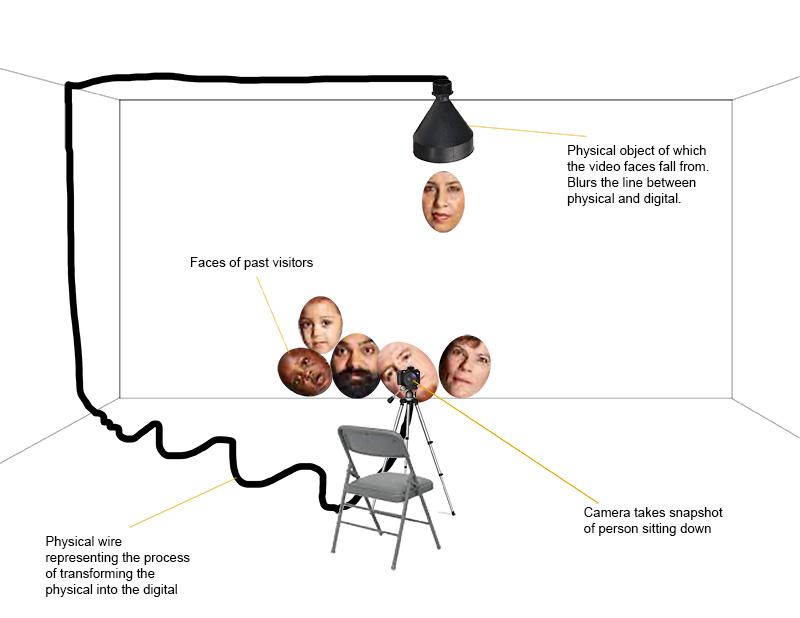
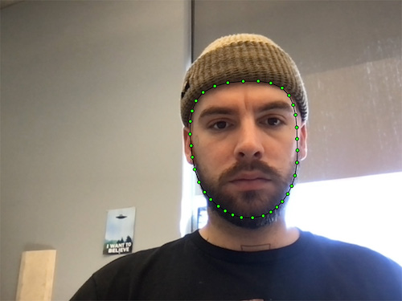
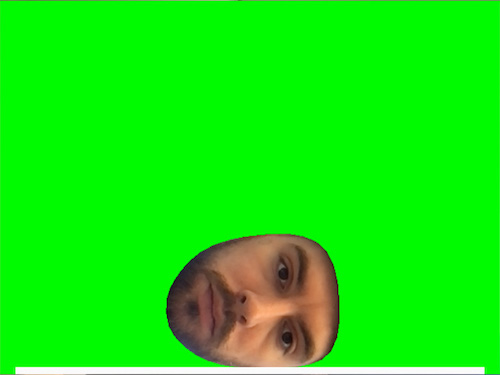
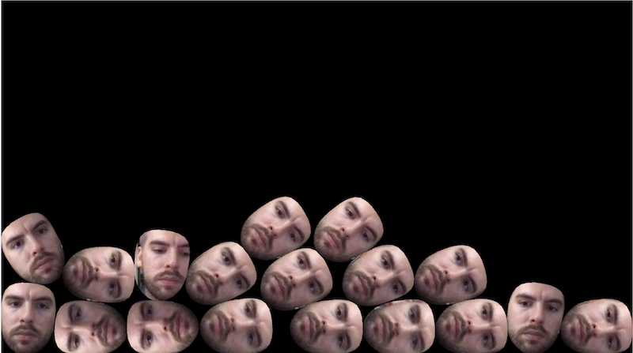
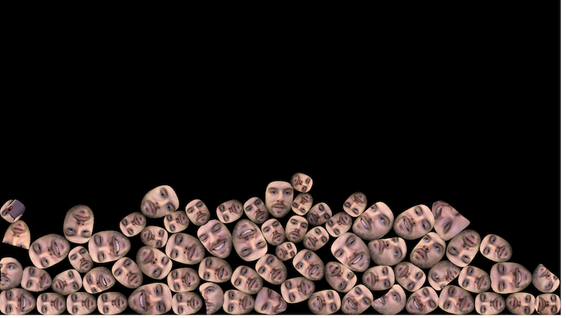
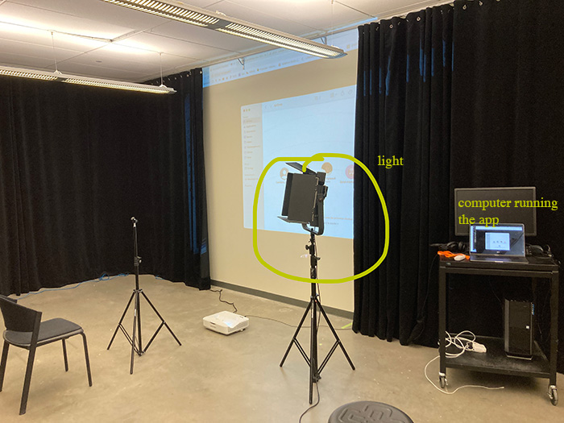
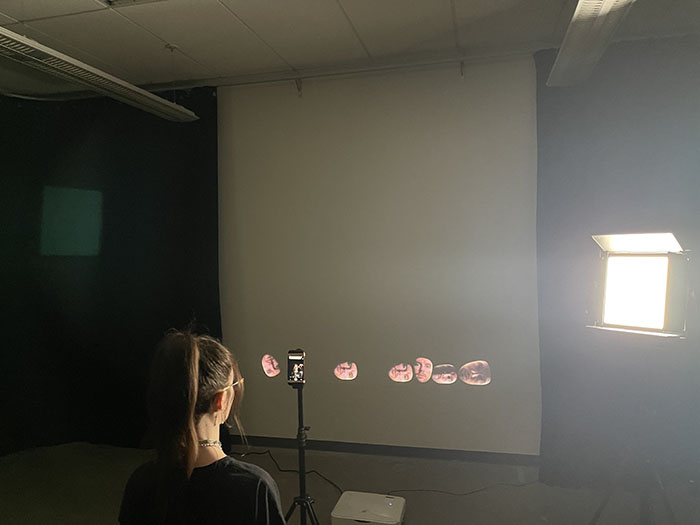
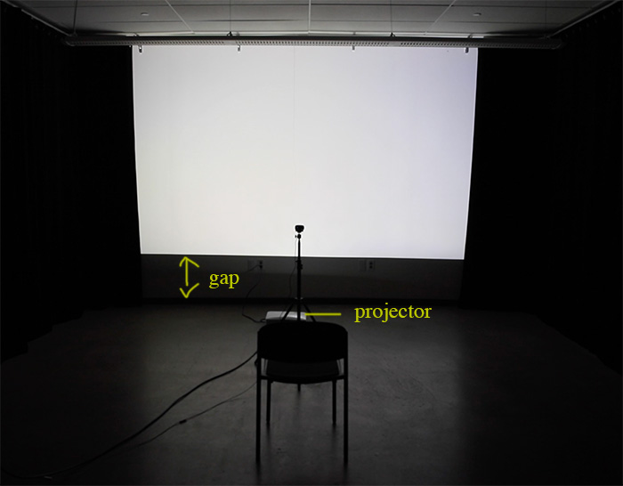

# Face Foundry (working title?)
Interactive installation prototype using ml5 facemesh, matter.js and p5.js.

### March 10 2023
Initial sketch and idea:

### March 22 2023 
As of now: I have a running p5.js sketch with a live video feed coming from webcam. When a face is detected using ml5, a line around the silhouette of the face is drawn as well as small green dots on each of the keypoints. 

When pressing enter, a snapshot of the entire canvas is taken. This image is then cropped tighter around the face (using the bounding rectangle provided by ml5). Using the face silhouette keypoints as vertices, a shape is created and used to build a new unique matter.js body. The cropped face image is positioned on top of its matter.js clone (like a texture) and added to the "world". The result is a face falling from the top of the screen, landing on the ground at the bottom of the canvas.

These were the first big steps I needed to take in order to jumpstart the project. I will now list things I need to implement in order to reach the second phase, before I can start to experiment in a physical space (because this is an installation and it's essential to also prototype in tangible ways). 

1. Have a second canvas where the face are actually added that will be displayed as a projection.
2. Implement Node.js to easily save the image snapshots on a server, as well as the position and the shape of each face. This will allow for the installation to save in specific states, to ensure it can reboot from its previous state if it stops running. The canvas can then accumulate faces from different sessions is there is desire to do so. 

### March 27 2023 

I implemented a database with mongoDB so that all the position, angle, vertices and image path of each face are stored indidividually. I was originally planning on doing this with Json but I was scared it would be too difficult to manage. I now have to figure out how to retrieve the information and run it so that the all the faces reappear at the position they were in last. I also need to figure out something: if I want to save everything again, I want my database to only save the new faces as new entities, and update the position and angle of the previously stored faces. Maybe I could also just delete everything and save it again as a whole... Because some faces are maybe going to dissappear if they fall to the side and are spliced from the array. I'm not even sure if I want to do that. Anyway, I want to learn how to retrieve and save stuff from the database in case I want to do it in different ways. I will start by writing code to get the stored data in the database and running it to recreate at least one face. 

My goal today is to do that and to create another canvas to add the faces on. I will create it on below the canvas with camera feed so we can see both. 

### March 29 2023 

I now have two canvases, one with the live video feed and ml5 stuff (that is hidden) and one were the faces are added, which will serve as a projection for the installation. It looks *nice* I think but I think I'm losing a bit of steam in terms of like is this an interesting project? I've been so focused on developping the application that now I'm looking at it and i'm like: oh cool, so... that's it? But I guess everything will be in how I present it, and sound and stuff. I also need to think about it conceptually (what it means for me). Still need to work out how I will get the data from my database and run it to position the faces with their according image at the position where they last were when I saved the state. Also.... can the faces fall and dissappear or something? or they kind of stay there forever...I guess i can't answer those things now because I'm tired and I also need to see the thing in a real space. 

### April 13 2023 

In the past weeks, I was mainly working on trying to test my installation in a physical space. I documented two different attempts. I noticed that my background for my face canvas could not stay black because if the lights are closed in the room (which they need to be in order for the projections to be good), everything is in the dark, and you can't even see the chair or the camera. I first tried to add a light on the side, but it produced weird shadows, and it felt out of place when looking at the installation as a whole.

I documented a short video of this version that can be seen [here](https://www.youtube.com/watch?v=qbS-pHGgWcY).

A week later, I tried hanging a lightbulb from the ceiling just above the chair and camera, but I didn't like the look of it. Everything started to feel a bit too dark and eerie, and I wasn't feeling the vibe. I decided to switch the background to white, this created enough light in the room and makes taking pictures better. Another problem I am having a problem accessing a projector hanging from the ceiling. The one that I have is a short-throw projector sitting on the floor, which means that there is a gap between the projection and the floor. I want the projection to be sitting on the floor to give the impression that the heads are hitting the floor.

Also, when the background was black, I had implemented a sort of white flash on the canvas, imitating the one of a camera that would momentarily light the room and the person while the picture was being taken. I liked the idea of this, but when the background is white, obviously, you don't see it. I didn't have any ideas to fix that, but when filming my video, I had the idea of putting my hand over the projector for a split second to give the illusion that a picture was taken and create a sort of cut in time, a sort of opposite flash. It turned out well in the final video, so I'm thinking of implementing a "black flash" to punctuate the idea of taking a picture. Obviously, it won't happen at the exact time the picture is taken since the room will be pitch black for a second, making the participant invisible to the camera. But it could happen slightly before.

I documented this version of the project [here](https://www.youtube.com/watch?v=Cix5-7LAViI).

*Both documentaiton videos have sound but it was only to test some sound avenues. I produced these two videos because I wanted to submit applications for art show calls.*

 ### April 28 2023 

 Yesterday I implemented the microcontroller with a pressure sensor. Now when applying pressure to the sensor triggers the camera and a picture of the face is taken. This is the first implementation of what is going to be on the chair later. 

 
 In action [here](https://youtu.be/xpJZmcdJnHk).

The treshold of the pressure sensor is working now with the finger, but will need to be adjusted when testing chairs with people of different weights. 

Today is the last day before September that I can get good technical help from the Computation Lab so I will try to setup a plan to fix some important issues. I will then be able to add more features during the summer. I'll also make a list and schedule about that in the following days. 

The three points I want to adress today are these ones :

1. Create a seperate file for my database password
2. Make project in two separate files listening to the same server to see if it fixes performance issues
3. At the start of the program, have the choice to run application from scratch or get data from database and run program from last save state. Image will then be drawn from saved image on server.